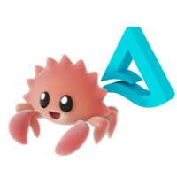

# Delta Kernel: A Universal Delta Lake Connector Framework

<span style="display:block;text-align:center">
  
 </span>


## Overview

Delta Kernel is a Rust library that aims to make building Delta connectors easy. It is query-engine agnostic, and also supports C/C++ engines via FFI. The kernel offers a protocol-agnostic abstraction layer that enables developers to read and write Delta tables without needing to understand the Delta protocol.

## Project Goals

### 1. **Protocol Abstraction**
Delta Kernel's primary goal is to shield connector developers from the complexity of the Delta protocol. Because protocol-specific logic is encapsulated by the kernel, connectors can support new Delta features by simply using a version of kernel that supports them. The kernel aims to make such updates as painless as possible so connectors can maintain support for cutting edge Delta features.

### 2. **Language Support**
The project supports the following language ecosystems:
- Native Rust integration for Rust-based systems
- C/C++ Foreign Function Interface (FFI) via the `ffi` crate
- The `ffi` bindings can be used as a foundation to build connections to other ecosystems

### 4. **Performance and Simplicity**
The project aims to provide:
- Minimal dependencies for core functionality
- Feature flags for optional components
- A default engine implementation that is sufficiently performant

## High-Level Architecture

### Core Components

```
┌──────────────────────────────────────────────────────┐
│                      Connectors                      │
│          (Query Engines, Analytics Tools, etc.)      │
└────────────┬─────────────────────────────┬───────────┘
             │                             │
             │                             │
┌────────────▼──────────┐     ┌────────────▼─────────┐
│    Rust Integration   │     │    FFI Bindings      │
│   (Native Rust API)   │     │  (C/C++ Interface)   │
└────────────┬──────────┘     └───────────┬──────────┘
             │                            │
             └──────────┬─────────────────┘
                        │
             ┌──────────▼──────────────┐
             │    Delta Kernel Core    │
             │  (Protocol Abstraction) │
             └──────────┬──────────────┘
                        │
        ┌───────────────┼───────────────┐
        │               │               │
┌───────▼─────┐ ┌───────▼──────┐ ┌─────▼───────┐
│   Engine    │ │   Storage    │ │ Expression  │
│    Trait    │ │   Handler    │ │  Evaluator  │
└─────────────┘ └──────────────┘ └─────────────┘
        │               │               │
┌───────▼───────────────▼───────────────▼─────┐
│         Engine Implementations              │
│  (DefaultEngine, Custom Engines, etc.)      │
└──────────────────────────────────────────────┘
```

### Crate Structure

The project is organized into several crates:

- **`kernel`**: Core library containing protocol logic, table operations, and trait definitions
- **`acceptance`**: Delta Acceptance Tests (DAT) validation suite
- **`derive-macros`**: Procedural macros for code generation
- **`ffi`**: C/C++ Foreign Function Interface for cross-language integration
- **`uc-client`**: Unity Catalog client integration
- **`uc-catalog`**: Unity Catalog implementation


### Key Abstractions

#### 1. **Scan API**
The entry point for reading Delta tables:
- Schema discovery
- Partition pruning
- File skipping
- Predicate pushdown
- Multi-version read support

#### 2. **Transaction API**
For writing data to Delta tables:
- Blind appends (currently supported)
- Transaction conflict resolution
- Commit protocol implementation
- Checkpoint creation

#### 3. **Snapshot Management**
Handles table state at specific versions:
- Metadata retrieval
- Protocol version handling
- Table features support
- Log replay and compaction

#### 4. **Data Types & Schema**
Provides a protocol-compliant type system:
- Primitive types (integers, strings, timestamps)
- Complex types (structs, arrays, maps)
- Schema evolution support
- Column mapping capabilities


### FFI Layer

The Foreign Function Interface enables:
- C-compatible ABI for cross-language bindings
- Memory-safe data exchange
- Callback-based async operations
- Error propagation across language boundaries

## Design Principles

1. **No Async in Core**: Async complexity is isolated to engine implementations
2. **Builder Pattern APIs**: Fluent interfaces for configuration and setup
3. **Feature Flag Modularity**: Pay only for what you use
4. **Clear I/O Boundaries**: Methods clearly indicate when I/O operations occur
5. **Protocol Compliance**: Strict adherence to Delta protocol specifications
6. **Memory Safety**: Leveraging Rust's ownership system for safe memory management

## Use Cases

Delta Kernel enables various integration scenarios:

- **Query Engine Integration**: Adding Delta support to SQL engines, dataframe libraries
- **Data Pipeline Tools**: Building ETL/ELT tools with Delta table support
- **Analytics Platforms**: Enabling direct Delta table access in BI tools
- **Cloud Services**: Creating managed Delta services with custom storage backends
- **Edge Computing**: Deploying Delta readers in resource-constrained environments via WASM

## Getting Started

For Rust projects, add to `Cargo.toml`:

```toml
# Minimal setup (bring your own engine)
delta_kernel = "0.17.1"

# With default Arrow-based engine
delta_kernel = { version = "0.17.1", features = ["default-engine", "arrow"] }
```

For C/C++ projects, build the FFI library and link against it. Examples are provided in the `ffi/examples` directory.

## Future Roadmap

The project continues to evolve with priorities on:
- Extended write operations (updates, deletes, merges)
- Advanced table features (CDC, deletion vectors)
- Performance optimizations
- Broader ecosystem integration
- Additional language bindings

Delta Kernel represents a crucial step toward making Delta Lake truly universal, providing a solid foundation for Delta connectors across the entire data ecosystem.
