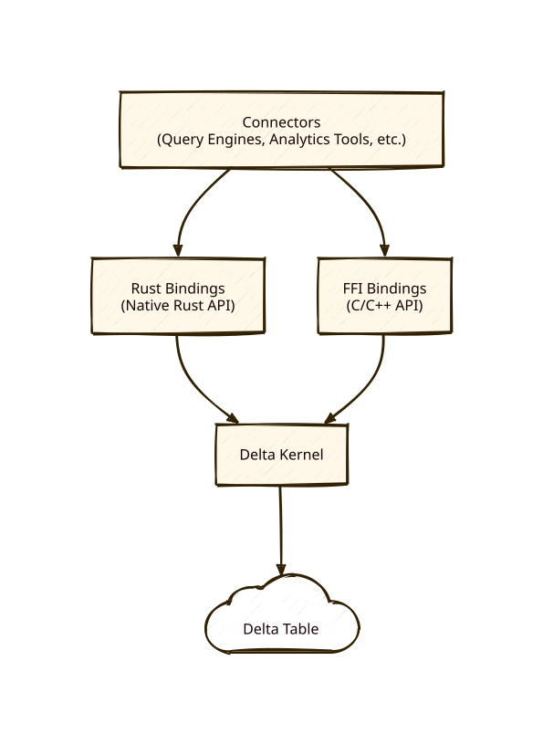

# Delta Kernel: A Universal Delta Lake Connector Framework

<span style="display:block;text-align:center">
  
 </span>


## Overview

Delta Kernel is a Rust library that aims to make building Delta connectors easy. It is query-engine agnostic, and also supports C/C++ engines via FFI. The kernel offers a protocol-agnostic abstraction layer that enables developers to read and write Delta tables without needing to understand the Delta protocol.

## Project Goals

### 1. **Protocol Abstraction**
Delta Kernel's primary goal is to shield connector developers from the complexity of the Delta protocol. Because protocol-specific logic is encapsulated by the kernel, connectors can support new Delta features by simply using a version of kernel that supports them. The kernel aims to make such updates as painless as possible so connectors can maintain support for cutting edge Delta features.

### 2. **Language Support**
The project supports the following language ecosystems:
- Native Rust integration for Rust-based systems
- C/C++ Foreign Function Interface (FFI) via the `ffi` crate
  - The `ffi` bindings can be used as a foundation to build connections to other ecosystems

### 4. **Performance and Simplicity**
The project aims to provide:
- Minimal dependencies for core functionality
- Feature flags for optional components
- A default engine implementation that is sufficiently performant

## High-Level Architecture

### Core Components


### Crate Structure

The project is organized into several crates:

- **`kernel`**: Core library containing protocol logic, table operations, and trait definitions
- **`acceptance`**: Delta Acceptance Tests (DAT) validation suite
- **`derive-macros`**: Procedural macros for code generation
- **`ffi`**: C/C++ Foreign Function Interface for cross-language integration
- **`uc-client`**: Unity Catalog client integration
- **`uc-catalog`**: Unity Catalog implementation

### Key API Concepts

The Kernel APIs are well documented in the rust doc, which can be viewed [here](https://docs.rs/delta-kernel).

The APIs fall into a few main categories:

#### 2. **Snapshot Management**
Provides a view of a Delta table at a specific version. Tables must _always_ be accessed as of a
particular version. APIs are provided to get the "latest" version. A Snapshot can provide:
- The table schema
- Properties and Features enabled on the table
- An entry point to scan the table
- An entry point to start a transaction on the table

#### 2. **Scan API**
The entry point for reading Delta tables:
- Constructed from a `Snapshot`
- Can specify a predicate which will prune out unneeded data files
- Can specify a schema to only select specific columns, or to request metadata columns

#### 3. **Transaction API**
Apis for writing to delta tables. Support includes:
- Blind appends (adding without reading any files)
- Removing files


#### 4. **Data Types & Schema**
Provides a protocol-compliant type system:
- Primitive types (integers, strings, timestamps)
- Complex types (structs, arrays, maps)


### FFI Layer

The Foreign Function Interface enables:
- C-compatible ABI for cross-language bindings
- A "handle" based system that provides some level of memory safety when crossing the FFI boundary

## Design Principles

2. **Builder Pattern APIs**: Fluent interfaces for configuration and setup
3. **Feature Flag Modularity**: Pay only for what you use
4. **Clear I/O Boundaries**: Methods clearly indicate when I/O operations occur
5. **Protocol Compliance**: Strict adherence to Delta protocol specifications

## Getting Started

For Rust projects, add to `Cargo.toml`:

```toml
# With default Arrow-based engine
delta_kernel = { version = "0.17.1", features = ["default-engine", "arrow"] }
```

For C/C++ projects, build the FFI library and link against it. Examples are provided in the `ffi/examples` directory.

